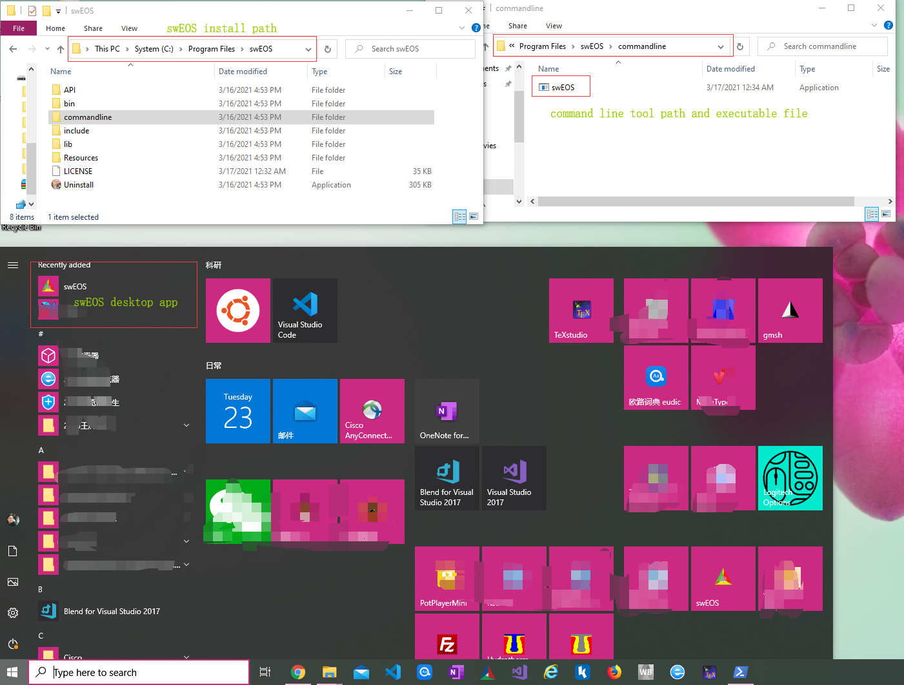
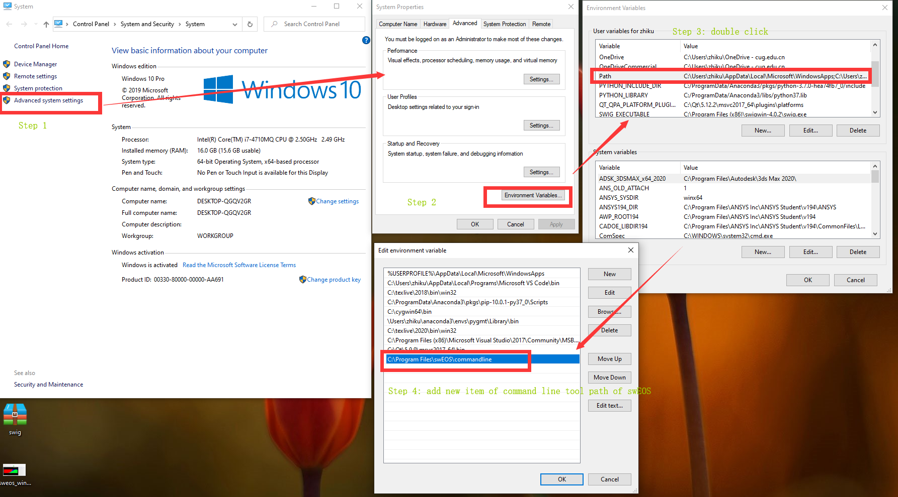

.. _install_windows:

*******************
Windows
*******************

.. include:: /include.rst_

Download 
=================

Please go to the |app_win_download| to download the proper version (e.g. windows 10) according to your system version.

Install
===========

The downloaded installer is a :code:`.exe` file.
Then double click it to install just like any other general windows software installer, there is nothing special. 
After successfully installing, one can get something like :numref:`fig:install:windows`.

    Snapshot of swEOS desktop app installed in windows 10 system.

Desktop app with GUI
-------------------------

If you want to use the GUI version of swEOS, just click the shortcut automatically added in the start menu (see :numref:`fig:install:windows`).

Command line tool
---------------------

The standalone command line tool(cmd) is also included in the installer, 
if you want to use this cmd app, 
just need to add the command line tool install path (see :numref:`fig:install:windows`) to the system environment variable of :code:`PATH` (see :numref:`fig:install:windows:setENVpath`).
Then :code:`swEOS` command can be used in PowerShell or traditional cmd terminal.

   Snapshot of environment variable setting.

